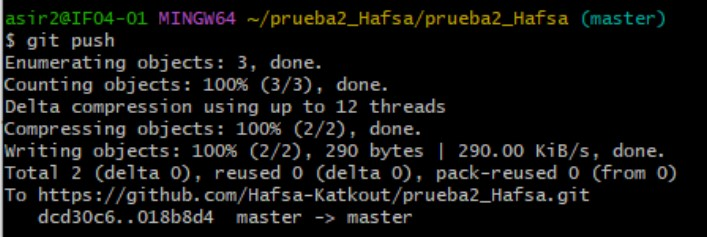

# Un título principal

## Un subtítulo

Este es un párrafo con **palabras en negrita**, *en cursiva*, y `esto está escrito en codigo` .

### Un trozo de código:

```bash
Esto es un trozo de codigo
```

## Una lista ordenada
1. Lunes
2. Martes
3. Miercoles
4. Jueves
5. Viernes
6. Sabado
7. Domingo
--- 
## Una lista desordenada 
- Lunes
- Martes 
- Miercoles
- ueves
- Viernes
- Sabado
- Domingo
  
## Un enlace a una URL externa :

[Para google](https://www.google.com)

## Un enlace a otro fichero Markdown que tengas en el repositorio:

[ejercicio1.md](ejercicio1.md)


## Una imagen:


## Una tabla:

|Nombre|Apellido 1|Apellido 2 |Clase |
|:------|:----------:|:-----------:|------:|
|Hafsa |  Katkout |AABIL      |ASIR2 |
